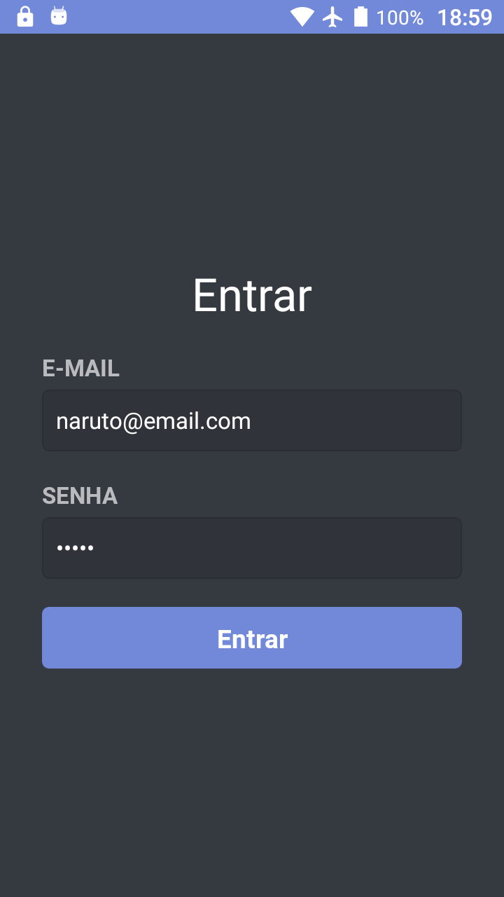

## GoStack Bootcamp Bonus 5

> 🚀 Practical project of the [Rocketseat](https://rocketseat.com.br) GoStack Bootcamp.  
👷 Developed by Matheus Ramalho de Oliveira.  
🔨 Systems Analyst, Full-Stack Developer.  
🏡 Goiânia, Goiás, Brasil.  
✉️ kastorcode@gmail.com  
👍 [instagram.com/kastorcode](https://www.instagram.com/kastorcode)

---

  

    Bonus 5, AdonisJS: Software as a Service(SaaS)

---

### Frontend Screenshots

  

  

  

  

  

  

### Mobile Screenshots

  

  

  

  

  

  

---

### 🔙 🔚 Backend installation and execution

1. Make a clone of this repository;
2. Enter the folder running `cd gostack-bonus-05-adonisjs-saas/backend`;
3. Run `yarn` to install dependencies;
4. Create a database in `postgres` with the name of `adonis-saas`;
5. Rename the `.env.example` file to `.env`;
6. Put your credentials within `.env`;
7. Run `adonis migration:run` to execute the migrations;
8. Run `adonis seed` to feed the database with the default user `Matheus` and other data;
9. Run `yarn start` to start the development server;
10. Import the `backend/insomnia/index.json` file in Insomnia to make calls to api.

### 💻️ Frontend installation and execution

1. Open the terminal in the `gostack-bonus-05-adonisjs-saas/frontend` folder;
2. Run `yarn` to install dependencies;
3. Run `yarn start` to start the development server;
4. Open the address `http://localhost:3000` in the browser.

### 📲 Mobile installation and execution

1. Open the terminal in the `gostack-bonus-05-adonisjs-saas/mobile` folder;
2. Run `yarn` to install dependencies;
3. Run `yarn start` to start the development server;
4. Run `yarn android` or `yarn ios` depending on the operating system.

### 🗝️ Default user

Name: `Matheus`;
Email: `email@email.com`;
Password: `123456`.

---

### 🗓 ️Roadmap

- Introduction to Node.js
- Creating Node.js project
- Continuing Node.js project
- CSS Flexbox
- UI Design
- Introduction to React
- First project with ReactJS
- First project with React Native
- Front-end documentation
- Flux architecture
- Using React Hooks
- Server-side rendering(SSR) with ReactJS
- GraphQL
- Expo
- Creating ReactJS project
- Creating React Native project
- Animations with React Native
- Full-stack app development
- Node.js tests
- Node.js deploy
- ReactJS tests
- React Native tests
- ReactJS deploy
- React Native publication
- WebSocket with Express
- Advanced patterns at Node.js
- OmniStack SaaS(software as a service) and AdonisJS
- Final challenge
- Monorepo
